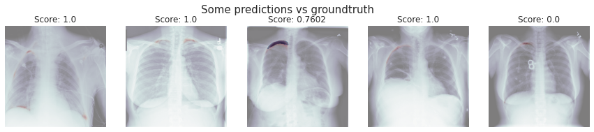

# SIIM-ACR Pneumothorax Segmentation
> Author: Adrià Carrasquilla Fortes
>
> DLMIA 2022-23

This notebook consists on the implementation of a machine learning solution for the SIIM-ACR Pneumothorax Segmentation challenge. It will introduce what is the goal of the contests, followed by some data exploration, the implementation of the solution and finally it explores the results with some conclusions.

## 1. Introduction
Pneumothorax is a medical condition in which air accumulates between the lung and the chest wall, causing the lung to collapse. It can be caused by a variety of factors, including trauma, lung infections, and certain medical procedures. Pneumothorax can be a serious condition, particularly if it is not treated promptly, as it can lead to difficulty breathing and other respiratory problems.

In the context of medical imaging, pneumothorax is easily detected by radiographist, but still can be challenging to detect and diagnose when such specialist is not present. However, advances in deep learning have made it possible to develop automated algorithms that can accurately identify and segment pneumothorax in medical images. This can be a valuable tool for doctors and other medical professionals, as it can help them to more quickly and accurately diagnose and treat patients with pneumothorax.

In this notebook, we will explore data from SIIM-ACR Pneumothorax Segmentation challenge from 2019 and implement deep learning models to tackle a kaggle challenge for pneumothorax segmentation in medical images.

This work includes inspiration from other participants solutions, specially for the more complex architecture that is implemented in section 3.2. Due to time and hardware limitations, this notebook does not aim to achieve competitive results. The main idea is to explore the ecosystem of such challenge, experiment with different set ups and architectures and compare the results. In order to overcome hardware and time limitations, a lower resolution version of the dataset will be used across the experiments.

## 2. Data Exploration
We will start by exploring what does the available data look like, in order to properly prepare it for the models to implement


```python
!pip install albumentations > /dev/null

# Imports
import os
import sys
import glob
import random

import cv2
import pydicom

import numpy as np
import pandas as pd

from tqdm.notebook import tqdm
from PIL import Image

import tensorflow as tf
from tensorflow.keras import *
from tensorflow.keras.layers import *
from tensorflow.keras import backend as K
from keras.losses import binary_crossentropy

from keras import Model
from keras.layers import Input, Conv2DTranspose
from keras.layers import Conv2D, MaxPooling2D
from keras.layers import Dropout, BatchNormalization

from keras.losses import binary_crossentropy
import keras.callbacks as callbacks
from keras.applications.xception import Xception

from keras.layers.merge import concatenate

import matplotlib.pyplot as plt
plt.style.use('seaborn-white')
import seaborn as sns
sns.set_style("white")

seed = 10
np.random.seed(seed)
random.seed(seed)
os.environ['PYTHONHASHSEED'] = str(seed)
np.random.seed(seed)
    
%matplotlib inline
```


```python
## Utilities for easing the data exploration through dicom (.dcm) files.
def print_dcm(sample):
    print()
    pat_name = sample.PatientName
    print("Displaying information for patient", pat_name)
    print("File                :", file_path)
    print()

    print("Id                  :", sample.PatientID)
    print("Age                 :", sample.PatientAge)
    print("Sex                 :", sample.PatientSex)
    print("Modality            :", sample.Modality)
    print("Body Part           :", sample.BodyPartExamined)
    print("View Position       :", sample.ViewPosition)
    print("Image size          : {} x {}".format(sample.Rows, sample.Columns))
    print()
    
def plot_pixel_array(sample, title=None):
    plt.figure(figsize=(8,8))
    plt.imshow(sample.pixel_array, cmap=plt.cm.bone)
    plt.axis("off")
    if title:
        plt.title(title)
    else:
        plt.title(f"{sample.Modality} for patient {sample.PatientID}")
    plt.show()
```

In order to see how our data looks like, we explore the dicom metadata and the image from 3 random dicom files from the training set.


```python
random.seed(1)
samples = random.sample(glob.glob('/kaggle/input/pneumothorax/train/dicom_files/*'), 3)

for file_path in samples:
    sample = pydicom.dcmread(file_path)
    print_dcm(sample)
    plot_pixel_array(sample)
```

    
    Displaying information for patient 622f2cd3-7403-45f0-a53d-7d88ba96055b
    File                : /kaggle/input/pneumothorax/train/dicom_files/1.2.276.0.7230010.3.1.4.8323329.13389.1517875245.104576.dcm
    
    Id                  : 622f2cd3-7403-45f0-a53d-7d88ba96055b
    Age                 : 35
    Sex                 : M
    Modality            : CR
    Body Part           : CHEST
    View Position       : PA
    Image size          : 1024 x 1024
    


    

    


    
    Displaying information for patient 15f05b19-3673-46a4-8a55-1952d4e2b829
    File                : /kaggle/input/pneumothorax/train/dicom_files/1.2.276.0.7230010.3.1.4.8323329.3340.1517875177.340788.dcm
    
    Id                  : 15f05b19-3673-46a4-8a55-1952d4e2b829
    Age                 : 57
    Sex                 : F
    Modality            : CR
    Body Part           : CHEST
    View Position       : PA
    Image size          : 1024 x 1024
    


    

    


    
    Displaying information for patient b0bc9545-e930-4390-a294-3b256a4c28dc
    File                : /kaggle/input/pneumothorax/train/dicom_files/1.2.276.0.7230010.3.1.4.8323329.32568.1517875161.247855.dcm
    
    Id                  : b0bc9545-e930-4390-a294-3b256a4c28dc
    Age                 : 52
    Sex                 : F
    Modality            : CR
    Body Part           : CHEST
    View Position       : AP
    Image size          : 1024 x 1024
    


    

    


We have just printed a few fields from the dicom metadata fields such as the patient ID, its age and sex. We can also see that all the samples seem to be CR scans of the chest with a size of 1024 by 1024.

We can also observe the is some text or other kind of artifacts (or medical equipment) that is visible in the images and that we bust be aware of during training.

Let's now visualize other samples with their respective masks. For this we will simply use the first n samples from the training dataset csv, so let's explore how this csv also looks like.


```python
train = pd.read_csv("/kaggle/input/pneumothorax/train/train-rle.csv")
train.head()
```


<div>
<style scoped>
    .dataframe tbody tr th:only-of-type {
        vertical-align: middle;
    }

    .dataframe tbody tr th {
        vertical-align: top;
    }

    .dataframe thead th {
        text-align: right;
    }
</style>
<table border="1" class="dataframe">
  <thead>
    <tr style="text-align: right;">
      <th></th>
      <th>ImageId</th>
      <th>EncodedPixels</th>
    </tr>
  </thead>
  <tbody>
    <tr>
      <th>0</th>
      <td>1.2.276.0.7230010.3.1.4.8323329.5597.151787518...</td>
      <td>-1</td>
    </tr>
    <tr>
      <th>1</th>
      <td>1.2.276.0.7230010.3.1.4.8323329.12515.15178752...</td>
      <td>-1</td>
    </tr>
    <tr>
      <th>2</th>
      <td>1.2.276.0.7230010.3.1.4.8323329.4904.151787518...</td>
      <td>175349 7 1013 12 1009 17 1005 19 1003 20 1002...</td>
    </tr>
    <tr>
      <th>3</th>
      <td>1.2.276.0.7230010.3.1.4.8323329.32579.15178751...</td>
      <td>407576 2 1021 7 1015 10 1013 12 1011 14 1008 ...</td>
    </tr>
    <tr>
      <th>4</th>
      <td>1.2.276.0.7230010.3.1.4.8323329.32579.15178751...</td>
      <td>252069 1 1021 3 1020 4 1018 5 1018 6 1016 7 1...</td>
    </tr>
  </tbody>
</table>
</div>


We can see it has two columns. The first one containing the image id that is also the name of input files and the EncodedPixels field. This second one contains a -1 if there is no pneumothorax to be segmented in the image, or the segmentation mask if there is indeed pneumothorax in the sample.


```python
def rle2mask(rle, width, height):
    '''
    RLE to mask conversion as given.
    It inputs the rle (EncodedPixel value) and return the mask value.
    '''
    mask= np.zeros(width* height)
    array = np.asarray([int(x) for x in rle.split()])
    starts = array[0::2]
    lengths = array[1::2]

    current_position = 0
    for index, start in enumerate(starts):
        current_position += start
        mask[current_position:current_position+lengths[index]] = 1
        current_position += lengths[index]

    return mask.reshape(width, height).T
```


```python
n_imgs = 3
root = "/kaggle/input/pneumothorax/train/dicom_files/"
for i in range(n_imgs):
    f_id = train["ImageId"][i]
    sample = pydicom.dcmread(f"{root}{f_id}.dcm")
    if train[" EncodedPixels"][i] == ' -1':
        plot_pixel_array(sample, title="No pneumotorax")
    else:
        plt.figure(figsize=(8,8))
        plt.imshow(sample.pixel_array, cmap=plt.cm.bone)
        mask = rle2mask(train[" EncodedPixels"][i][1:], sample.Rows, sample.Columns) * 255
        plt.imshow(mask, alpha=0.3, cmap="Reds")
        plt.axis("off")
        plt.title("Pneumotorax present")
        plt.show()
```


    

    


    

    


    

    


## 3. Implementation and results
In this section we implement 3 different approaches:
* Unet
* Xception Unet
* Xception Unet with data augmentation

The first one is one of the most simple segmentation solutions we can use and it will be implemented to explore how far it could go with this dataset. The last two ones are based on other participants of the contest who achieved good results using such architecture. We want to see how better results we can get compared to the base unet.

### 3.0 Utilities
In this first section we implement some utilities that will be usefull for the implementations tried in the notebook


```python
im_height = 1024
im_width = 1024
target_height = 256
target_width = 256
im_chan = 1

def get_data(files_path, train_df):
    # Get train images and masks
    X_train = np.zeros((len(files_path), target_height, target_width, im_chan), dtype=np.uint8)
    Y_train = np.zeros((len(files_path), target_height, target_width, 1), dtype=bool)
    print('Getting train images and masks ... ')
    sys.stdout.flush()
    for n, _id in tqdm(enumerate(files_path), total=len(files_path)):
        dataset = pydicom.read_file(_id)
        img =  np.expand_dims(dataset.pixel_array, axis=2)
        X_train[n] = cv2.resize(img, (target_height, target_width))[..., np.newaxis]
        try:
            if '-1' in train_df.loc[_id.split('/')[-1][:-4],' EncodedPixels']:
                Y_train[n] = np.zeros((target_height, target_width, 1))
            else:
                if type(train_df.loc[_id.split('/')[-1][:-4],' EncodedPixels']) == str:
                    mask =  np.expand_dims(rle2mask(train_df.loc[_id.split('/')[-1][:-4],' EncodedPixels'], 1024, 1024), axis=2)
                    Y_train[n] = cv2.resize(mask, (target_height, target_width))[..., np.newaxis]
                else:
                    mask = np.zeros((1024, 1024, 1))
                    for x in train_df.loc[_id.split('/')[-1][:-4],' EncodedPixels']:
                        mask =  mask + np.expand_dims(rle2mask(x, 1024, 1024), axis=2)
                    Y_train[n] = cv2.resize(mask, (target_height, target_width))[..., np.newaxis]
        except KeyError:
            print(f"Key {_id.split('/')[-1][:-4]} without mask, assuming healthy patient.")
            Y_train[n] = np.zeros((target_height, target_width, 1)) # Assume missing masks are empty masks.

    print('Done!')
    return X_train, Y_train
```

As seen in the previous cell, we used the csv file to load all the training data. This is used in the first approach implementation. The images are retrieved from the dicom file and the masks are generated from the dataset csv. For that we use the rle2mask utility for those samples that have a mask or set everything to 0 when there is no pneumothorax (and thus no mask) in a sample.


```python
h, w, batch_size = 256,256,16
val_split = 0.1
test_split = 0.1
im_paths = f'/kaggle/input/pneumothorax/train/images/{h}/dicom/'
mask_paths = f'/kaggle/input/pneumothorax/train/images/{h}/mask/'
all_ims = glob.glob(im_paths+'/*')
all_masks = glob.glob(mask_paths+'/*')

class DataGenerator(tf.keras.utils.Sequence):
    'Generates data for Keras'
    def __init__(self, train_im_path, train_mask_path, im_path=im_paths, mask_path=mask_paths,
                 augmentations=None, batch_size=batch_size,img_size=256, n_channels=3, shuffle=True):
        'Initialization'
        self.batch_size = batch_size
        self.train_im_paths = train_im_path
        
        self.train_im_path = im_path
        self.train_mask_path = mask_path

        self.img_size = img_size
        
        self.n_channels = n_channels
        self.shuffle = shuffle
        self.augment = augmentations
        self.on_epoch_end()

    def __len__(self):
        'Denotes the number of batches per epoch'
        return int(np.ceil(len(self.train_im_paths) / self.batch_size))

    def __getitem__(self, index):
        'Generate one batch of data'
        # Generate indexes of the batch
        indexes = self.indexes[index*self.batch_size:min((index+1)*self.batch_size,len(self.train_im_paths))]

        # Find list of IDs
        list_IDs_im = [self.train_im_paths[k] for k in indexes]

        # Generate data
        X, y = self.data_generation(list_IDs_im)

        if self.augment is None:
            return X,np.array(y)/255
        else:            
            im,mask = [],[]   
            for x,y in zip(X,y):
                augmented = self.augment(image=x, mask=y)
                im.append(augmented['image'])
                mask.append(augmented['mask'])
            return np.array(im),np.array(mask)/255

    def on_epoch_end(self):
        'Updates indexes after each epoch'
        self.indexes = np.arange(len(self.train_im_paths))
        if self.shuffle == True:
            np.random.shuffle(self.indexes)

    def data_generation(self, list_IDs_im):
        'Generates data containing batch_size samples' # X : (n_samples, *dim, n_channels)
        # Initialization
        X = np.empty((len(list_IDs_im),self.img_size,self.img_size, self.n_channels))
        y = np.empty((len(list_IDs_im),self.img_size,self.img_size, 1))

        # Generate data
        for i, im_path in enumerate(list_IDs_im):
            
            im = np.array(Image.open(im_path))
            mask_path = im_path.replace(self.train_im_path, self.train_mask_path)
            
            mask = np.array(Image.open(mask_path))
            
            
            if len(im.shape)==2:
                im = np.repeat(im[...,None],3,2)

            # Resize sample
            X[i,] = cv2.resize(im,(self.img_size,self.img_size))

            # Store class
            y[i,] = cv2.resize(mask,(self.img_size,self.img_size))[..., np.newaxis]
            y[y>0] = 255

        return np.uint8(X),np.uint8(y)
    

def shuffle_and_split_data(imgs, masks, val_split=0.1, test_split=0.1):
    """
    Shuffle and split data into train, val and test datasets.
    """
    
    tmp = list(zip(imgs, masks))
    random.shuffle(tmp)
    imgs, masks = zip(*tmp)
    imgs, masks = list(imgs), list(masks)
    val_idx = int(len(imgs)*(val_split + test_split))
    test_idx = int(len(imgs)*test_split)
    
    return imgs[val_idx:], masks[val_idx:], imgs[test_idx:val_idx], masks[test_idx:val_idx], imgs[:test_idx], masks[:test_idx]
```

For the second approach we instad use directly the png files for both the chest image and the mask groundtruth, this time with a custom DataGenerator class to be integrated with the keras ecosystem. Since the dataset does not include validation splits and the test masks are all empty (no available gt), we will be just splitting the train images (10k) into training, validation and test sets. We will use the previously defined function that will shuffle all the files and separate it into three sets accordingly to the test and val split ratios.


```python
def dice_coefficient(y_true, y_pred):
    # Flatten the data
    y_true_flat = K.flatten(y_true)
    y_pred_flat = K.flatten(y_pred)
    
    y_pred = K.cast(y_pred_flat, 'float32')
    y_pred_f = K.cast(K.greater(y_pred, 0.3), 'float32')

    # Calculate the intersection of the two sets
    intersection = K.sum(y_true_flat * y_pred_f)

    # Calculate the union of the two sets
    union = K.sum(y_true_flat) + K.sum(y_pred_f)

    # Handle empty masks
    if union == 0:
        return 1.

    # Calculate and return the Dice coefficient
    dice = 2. * intersection / union
    return dice

def dice_loss(y_true, y_pred):
    smooth = 1.
    y_true_f = K.flatten(y_true)
    y_pred_f = K.flatten(y_pred)
    intersection = y_true_f * y_pred_f
    score = (2. * K.sum(intersection) + smooth) / (K.sum(y_true_f) + K.sum(y_pred_f) + smooth)
    return 1. - score

def bce_dice_loss(y_true, y_pred):
    return binary_crossentropy(y_true, y_pred) + dice_loss(y_true, y_pred)

def bce_logdice_loss(y_true, y_pred):
    return binary_crossentropy(y_true, y_pred) - K.log(1. - dice_loss(y_true, y_pred))
```

We also define here the main metric we will use to evaluate and monitor our models: Dice Coefficient. This version of the function is adapted to be attached as a custom metric function in the Keras ecosystem. It will perform operation within the tensors used in the trainin/evaluation process. We also define its equivalent to loss function dice_loss that will be used by both the binary crossentropy dice loss extension and the binary crossentropy log dice loss extension.


```python
def convolution_block(x, filters, size, strides=(1,1), padding='same', activation=True):
    x = Conv2D(filters, size, strides=strides, padding=padding)(x)
    x = BatchNormalization()(x)
    if activation == True:
        x = LeakyReLU(alpha=0.1)(x)
    return x

def residual_block(blockInput, num_filters=16):
    x = LeakyReLU(alpha=0.1)(blockInput)
    x = BatchNormalization()(x)
    blockInput = BatchNormalization()(blockInput)
    x = convolution_block(x, num_filters, (3,3) )
    x = convolution_block(x, num_filters, (3,3), activation=False)
    x = Add()([x, blockInput])
    return x

class SnapshotCallbackBuilder:
    def __init__(self, nb_epochs, nb_snapshots, init_lr=0.1):
        self.T = nb_epochs
        self.M = nb_snapshots
        self.alpha_zero = init_lr

    def get_callbacks(self, model_prefix='Model'):

        callback_list = [
            callbacks.ModelCheckpoint("./keras.model", monitor='val_dice_coefficient', 
                                   mode = 'max', save_best_only=True, verbose=1),
            callbacks.LearningRateScheduler(schedule=self._cosine_anneal_schedule)
        ]

        return callback_list

    def _cosine_anneal_schedule(self, t):
        cos_inner = np.pi * (t % (self.T // self.M))  # t - 1 is used when t has 1-based indexing.
        cos_inner /= self.T // self.M
        cos_out = np.cos(cos_inner) + 1
        return float(self.alpha_zero / 2 * cos_out)
```

We add some layering helpers to reduce the amount of code when defining more complex networks. We also create a custom SnapshotCallback builder that saves the model and has a cosine_anneal learning rate scheduler.


```python
def plot_history(history):
    # Visualize training history
    plt.figure(figsize=(15,8))
    plt.plot(history.history['dice_coefficient'])
    plt.plot(history.history['val_dice_coefficient'])
    plt.title('Model dice coefficient', size=20)
    plt.ylabel('Dice coefficient', size=15)
    plt.xlabel('Epoch', size=15)
    plt.legend(['train', 'val'], loc='upper left')
    plt.show()

    plt.figure(figsize=(15,8))
    plt.plot(history.history['loss'])
    plt.plot(history.history['val_loss'])
    plt.title('Model loss', size=20)
    plt.ylabel('Loss', size=15)
    plt.xlabel('Epoch', size=15)
    plt.legend(['train', 'val'], loc='upper left')
    plt.show()
    
def visualize_predictions(prediction, generator, max_imgs=5, offset=0):
    max_imgs = 5
    offset = 0
    fig, axs = plt.subplots(1, max_imgs, figsize=(max_imgs*3, 1*3))
    for i in range(0,max_imgs):
        test_img, test_mask = generator.__getitem__(i + offset)
        axs[i].imshow(test_img[0], cmap=plt.cm.bone)
        axs[i].imshow(prediction[i + offset], alpha=0.3, cmap="Reds")
        axs[i].imshow(test_mask[0], alpha=0.3, cmap="Blues")
        axs[i].axis("off")
        score = dice_coefficient(K.cast(test_mask[0], "float32"), prediction[i + offset])
        axs[i].set_title(f"Score: {score:.4}")

    plt.suptitle("Some predictions vs groundtruth", size=15)
    plt.show()
```

Since we will be plotting the history of several models, we also make a function that will do it for us with just the model history object as parameter. We will also be plotting some predictions after that, so having the visualize_predictions will be helpful too.

### 3.1 First implementation: base Unet
As a first approach we will be defining a basic Unet to tackle the problem of the challenge. We first define a way of loading the training data. Then some auxiliary functions that will be helpful (more comments on those along the code) and finally the Unet model. We train it and explore some results.

#### 3.1.1 Setup
We will load all the data directly to memory using the csv file method first.


```python
# Create training and test dataset from the csv file
train_files = sorted(glob.glob('/kaggle/input/pneumothorax/train/dicom_files/*'))
test_files = sorted(glob.glob('/kaggle/input/pneumothorax/test/dicom_files/*'))
train_df = pd.read_csv('/kaggle/input/pneumothorax/train/train-rle.csv', index_col='ImageId')
X_train, Y_train = get_data(train_files, train_df)
```

    Getting train images and masks ... 


      0%|          | 0/10712 [00:00<?, ?it/s]


    Key 1.2.276.0.7230010.3.1.4.8323329.10231.1517875222.737143 without mask, assuming healthy patient.
    Key 1.2.276.0.7230010.3.1.4.8323329.10362.1517875223.377845 without mask, assuming healthy patient.
    Key 1.2.276.0.7230010.3.1.4.8323329.10407.1517875223.567351 without mask, assuming healthy patient.
    Key 1.2.276.0.7230010.3.1.4.8323329.10599.1517875224.488727 without mask, assuming healthy patient.
    Key 1.2.276.0.7230010.3.1.4.8323329.1068.1517875166.144255 without mask, assuming healthy patient.
    Key 1.2.276.0.7230010.3.1.4.8323329.11104.1517875231.169401 without mask, assuming healthy patient.
    Key 1.2.276.0.7230010.3.1.4.8323329.11215.1517875231.757436 without mask, assuming healthy patient.
    Key 1.2.276.0.7230010.3.1.4.8323329.11557.1517875233.601090 without mask, assuming healthy patient.
    Key 1.2.276.0.7230010.3.1.4.8323329.11566.1517875233.640521 without mask, assuming healthy patient.
    Key 1.2.276.0.7230010.3.1.4.8323329.11577.1517875233.694347 without mask, assuming healthy patient.
    Key 1.2.276.0.7230010.3.1.4.8323329.11584.1517875233.731531 without mask, assuming healthy patient.
    Key 1.2.276.0.7230010.3.1.4.8323329.12062.1517875237.179186 without mask, assuming healthy patient.
    Key 1.2.276.0.7230010.3.1.4.8323329.13378.1517875244.961609 without mask, assuming healthy patient.
    Key 1.2.276.0.7230010.3.1.4.8323329.13415.1517875245.218707 without mask, assuming healthy patient.
    Key 1.2.276.0.7230010.3.1.4.8323329.13620.1517875246.884737 without mask, assuming healthy patient.
    Key 1.2.276.0.7230010.3.1.4.8323329.14557.1517875252.690062 without mask, assuming healthy patient.
    Key 1.2.276.0.7230010.3.1.4.8323329.2083.1517875171.71387 without mask, assuming healthy patient.
    Key 1.2.276.0.7230010.3.1.4.8323329.2187.1517875171.557615 without mask, assuming healthy patient.
    Key 1.2.276.0.7230010.3.1.4.8323329.2309.1517875172.75133 without mask, assuming healthy patient.
    Key 1.2.276.0.7230010.3.1.4.8323329.2563.1517875173.431928 without mask, assuming healthy patient.
    Key 1.2.276.0.7230010.3.1.4.8323329.2630.1517875173.773726 without mask, assuming healthy patient.
    Key 1.2.276.0.7230010.3.1.4.8323329.3089.1517875176.36192 without mask, assuming healthy patient.
    Key 1.2.276.0.7230010.3.1.4.8323329.31801.1517875156.929061 without mask, assuming healthy patient.
    Key 1.2.276.0.7230010.3.1.4.8323329.32302.1517875159.778024 without mask, assuming healthy patient.
    Key 1.2.276.0.7230010.3.1.4.8323329.32688.1517875161.809571 without mask, assuming healthy patient.
    Key 1.2.276.0.7230010.3.1.4.8323329.3321.1517875177.247887 without mask, assuming healthy patient.
    Key 1.2.276.0.7230010.3.1.4.8323329.3352.1517875177.433385 without mask, assuming healthy patient.
    Key 1.2.276.0.7230010.3.1.4.8323329.3714.1517875179.128897 without mask, assuming healthy patient.
    Key 1.2.276.0.7230010.3.1.4.8323329.3791.1517875179.436805 without mask, assuming healthy patient.
    Key 1.2.276.0.7230010.3.1.4.8323329.4134.1517875181.277174 without mask, assuming healthy patient.
    Key 1.2.276.0.7230010.3.1.4.8323329.4373.1517875182.554858 without mask, assuming healthy patient.
    Key 1.2.276.0.7230010.3.1.4.8323329.4468.1517875183.20323 without mask, assuming healthy patient.
    Key 1.2.276.0.7230010.3.1.4.8323329.4843.1517875185.73985 without mask, assuming healthy patient.
    Key 1.2.276.0.7230010.3.1.4.8323329.4996.1517875185.888529 without mask, assuming healthy patient.
    Key 1.2.276.0.7230010.3.1.4.8323329.5087.1517875186.354925 without mask, assuming healthy patient.
    Key 1.2.276.0.7230010.3.1.4.8323329.5278.1517875187.330082 without mask, assuming healthy patient.
    Key 1.2.276.0.7230010.3.1.4.8323329.5543.1517875188.726955 without mask, assuming healthy patient.
    Done!


We now explore again some samples with the new way of loading the dataset just to make sure everything is stored as expected.


```python
n_imgs = 5
fig, ax = plt.subplots(nrows=1, ncols=n_imgs, sharey=True, figsize=(20,5))
for i in range(n_imgs):
    ax[i].imshow(X_train[i+4], cmap=plt.cm.bone)
    ax[i].imshow(Y_train[i+4], cmap="Reds", alpha=0.3)
    ax[i].axis("off")
plt.suptitle("Some training samples", size=20)
plt.tight_layout()
plt.show()
```


    

    


#### 3.1.2 Unet model
At this point we define the Unet architecture


```python
def UNet(input_shape=(None, None, 1)):

    inputs = Input(input_shape)

    c1 = Conv2D(8, (3, 3), activation='relu', padding='same') (inputs)
    c1 = Conv2D(8, (3, 3), activation='relu', padding='same') (c1)
    p1 = MaxPooling2D((2, 2)) (c1)

    c2 = Conv2D(16, (3, 3), activation='relu', padding='same') (p1)
    c2 = Conv2D(16, (3, 3), activation='relu', padding='same') (c2)
    p2 = MaxPooling2D((2, 2)) (c2)

    c3 = Conv2D(32, (3, 3), activation='relu', padding='same') (p2)
    c3 = Conv2D(32, (3, 3), activation='relu', padding='same') (c3)
    p3 = MaxPooling2D((2, 2)) (c3)

    c4 = Conv2D(64, (3, 3), activation='relu', padding='same') (p3)
    c4 = Conv2D(64, (3, 3), activation='relu', padding='same') (c4)
    p4 = MaxPooling2D(pool_size=(2, 2)) (c4)

    c5 = Conv2D(64, (3, 3), activation='relu', padding='same') (p4)
    c5 = Conv2D(64, (3, 3), activation='relu', padding='same') (c5)
    p5 = MaxPooling2D(pool_size=(2, 2)) (c5)

    c55 = Conv2D(128, (3, 3), activation='relu', padding='same') (p5)
    c55 = Conv2D(128, (3, 3), activation='relu', padding='same') (c55)

    u6 = Conv2DTranspose(64, (2, 2), strides=(2, 2), padding='same') (c55)
    u6 = concatenate([u6, c5])
    c6 = Conv2D(64, (3, 3), activation='relu', padding='same') (u6)
    c6 = Conv2D(64, (3, 3), activation='relu', padding='same') (c6)

    u71 = Conv2DTranspose(32, (2, 2), strides=(2, 2), padding='same') (c6)
    u71 = concatenate([u71, c4])
    c71 = Conv2D(32, (3, 3), activation='relu', padding='same') (u71)
    c61 = Conv2D(32, (3, 3), activation='relu', padding='same') (c71)

    u7 = Conv2DTranspose(32, (2, 2), strides=(2, 2), padding='same') (c61)
    u7 = concatenate([u7, c3])
    c7 = Conv2D(32, (3, 3), activation='relu', padding='same') (u7)
    c7 = Conv2D(32, (3, 3), activation='relu', padding='same') (c7)

    u8 = Conv2DTranspose(16, (2, 2), strides=(2, 2), padding='same') (c7)
    u8 = concatenate([u8, c2])
    c8 = Conv2D(16, (3, 3), activation='relu', padding='same') (u8)
    c8 = Conv2D(16, (3, 3), activation='relu', padding='same') (c8)

    u9 = Conv2DTranspose(8, (2, 2), strides=(2, 2), padding='same') (c8)
    u9 = concatenate([u9, c1], axis=3)
    c9 = Conv2D(8, (3, 3), activation='relu', padding='same') (u9)
    c9 = Conv2D(8, (3, 3), activation='relu', padding='same') (c9)

    outputs = Conv2D(1, (1, 1), activation='sigmoid') (c9)

    model = Model(inputs=[inputs], outputs=[outputs])
    
    return model
```

#### 3.1.3 Training of the model
We now proceed to train the model for 30 epochs. We will use binary crossentropy as the loss function and the dice coefficient as the metric to keep track of.


```python
# Training with the first approach for the data
img_size = 256
epochs = 40

model = UNet(input_shape=(img_size, img_size, 1))
metrics = [dice_coefficient]
model.compile(optimizer='adam', loss='binary_crossentropy', metrics=metrics)

history = model.fit(X_train, Y_train, validation_split=.2, batch_size=32, epochs=epochs)
```

    2022-12-26 23:54:35.718439: I tensorflow/compiler/mlir/mlir_graph_optimization_pass.cc:185] None of the MLIR Optimization Passes are enabled (registered 2)


    Epoch 1/40


    2022-12-26 23:54:38.126402: I tensorflow/stream_executor/cuda/cuda_dnn.cc:369] Loaded cuDNN version 8005


    268/268 [==============================] - 32s 86ms/step - loss: 0.0320 - dice_coefficient: 2.9299e-04 - val_loss: 0.0211 - val_dice_coefficient: 6.9091e-05
    Epoch 2/40
    268/268 [==============================] - 21s 79ms/step - loss: 0.0193 - dice_coefficient: 3.0815e-04 - val_loss: 0.0200 - val_dice_coefficient: 1.3049e-04
    Epoch 3/40
    268/268 [==============================] - 21s 79ms/step - loss: 0.0181 - dice_coefficient: 3.0039e-04 - val_loss: 0.0192 - val_dice_coefficient: 1.0658e-04
    Epoch 4/40
    268/268 [==============================] - 21s 78ms/step - loss: 0.0176 - dice_coefficient: 6.5427e-04 - val_loss: 0.0188 - val_dice_coefficient: 0.0016
    Epoch 5/40
    268/268 [==============================] - 21s 79ms/step - loss: 0.0166 - dice_coefficient: 0.0024 - val_loss: 0.0177 - val_dice_coefficient: 0.0026
    Epoch 6/40
    268/268 [==============================] - 21s 78ms/step - loss: 0.0160 - dice_coefficient: 0.0084 - val_loss: 0.0176 - val_dice_coefficient: 0.0108
    Epoch 7/40
    268/268 [==============================] - 21s 79ms/step - loss: 0.0155 - dice_coefficient: 0.0207 - val_loss: 0.0165 - val_dice_coefficient: 0.0209
    Epoch 8/40
    268/268 [==============================] - 21s 79ms/step - loss: 0.0149 - dice_coefficient: 0.0460 - val_loss: 0.0170 - val_dice_coefficient: 0.0423
    Epoch 9/40
    268/268 [==============================] - 22s 83ms/step - loss: 0.0144 - dice_coefficient: 0.0797 - val_loss: 0.0164 - val_dice_coefficient: 0.1095
    Epoch 10/40
    268/268 [==============================] - 21s 78ms/step - loss: 0.0139 - dice_coefficient: 0.1204 - val_loss: 0.0151 - val_dice_coefficient: 0.1238
    Epoch 11/40
    268/268 [==============================] - 21s 78ms/step - loss: 0.0137 - dice_coefficient: 0.1373 - val_loss: 0.0152 - val_dice_coefficient: 0.1669
    Epoch 12/40
    268/268 [==============================] - 21s 79ms/step - loss: 0.0126 - dice_coefficient: 0.1895 - val_loss: 0.0158 - val_dice_coefficient: 0.1701
    Epoch 13/40
    268/268 [==============================] - 21s 78ms/step - loss: 0.0123 - dice_coefficient: 0.2142 - val_loss: 0.0169 - val_dice_coefficient: 0.1280
    Epoch 14/40
    268/268 [==============================] - 21s 79ms/step - loss: 0.0118 - dice_coefficient: 0.2493 - val_loss: 0.0144 - val_dice_coefficient: 0.2001
    Epoch 15/40
    268/268 [==============================] - 21s 79ms/step - loss: 0.0114 - dice_coefficient: 0.2745 - val_loss: 0.0146 - val_dice_coefficient: 0.2128
    Epoch 16/40
    268/268 [==============================] - 21s 78ms/step - loss: 0.0110 - dice_coefficient: 0.2812 - val_loss: 0.0142 - val_dice_coefficient: 0.1969
    Epoch 17/40
    268/268 [==============================] - 21s 79ms/step - loss: 0.0103 - dice_coefficient: 0.3414 - val_loss: 0.0143 - val_dice_coefficient: 0.2279
    Epoch 18/40
    268/268 [==============================] - 21s 79ms/step - loss: 0.0102 - dice_coefficient: 0.3360 - val_loss: 0.0172 - val_dice_coefficient: 0.2049
    Epoch 19/40
    268/268 [==============================] - 21s 78ms/step - loss: 0.0097 - dice_coefficient: 0.3717 - val_loss: 0.0143 - val_dice_coefficient: 0.2048
    Epoch 20/40
    268/268 [==============================] - 21s 79ms/step - loss: 0.0088 - dice_coefficient: 0.4212 - val_loss: 0.0148 - val_dice_coefficient: 0.1996
    Epoch 21/40
    268/268 [==============================] - 21s 79ms/step - loss: 0.0084 - dice_coefficient: 0.4407 - val_loss: 0.0142 - val_dice_coefficient: 0.2558
    Epoch 22/40
    268/268 [==============================] - 21s 78ms/step - loss: 0.0080 - dice_coefficient: 0.4684 - val_loss: 0.0148 - val_dice_coefficient: 0.2015
    Epoch 23/40
    268/268 [==============================] - 21s 78ms/step - loss: 0.0076 - dice_coefficient: 0.4925 - val_loss: 0.0151 - val_dice_coefficient: 0.2511
    Epoch 24/40
    268/268 [==============================] - 21s 79ms/step - loss: 0.0071 - dice_coefficient: 0.5159 - val_loss: 0.0149 - val_dice_coefficient: 0.2602
    Epoch 25/40
    268/268 [==============================] - 21s 78ms/step - loss: 0.0069 - dice_coefficient: 0.5417 - val_loss: 0.0183 - val_dice_coefficient: 0.2478
    Epoch 26/40
    268/268 [==============================] - 21s 79ms/step - loss: 0.0067 - dice_coefficient: 0.5484 - val_loss: 0.0154 - val_dice_coefficient: 0.2496
    Epoch 27/40
    268/268 [==============================] - 21s 79ms/step - loss: 0.0062 - dice_coefficient: 0.5822 - val_loss: 0.0151 - val_dice_coefficient: 0.2487
    Epoch 28/40
    268/268 [==============================] - 21s 78ms/step - loss: 0.0061 - dice_coefficient: 0.5816 - val_loss: 0.0166 - val_dice_coefficient: 0.2823
    Epoch 29/40
    268/268 [==============================] - 21s 78ms/step - loss: 0.0056 - dice_coefficient: 0.6185 - val_loss: 0.0202 - val_dice_coefficient: 0.2392
    Epoch 30/40
    268/268 [==============================] - 21s 78ms/step - loss: 0.0055 - dice_coefficient: 0.6216 - val_loss: 0.0230 - val_dice_coefficient: 0.2728
    Epoch 31/40
    268/268 [==============================] - 21s 78ms/step - loss: 0.0054 - dice_coefficient: 0.6283 - val_loss: 0.0171 - val_dice_coefficient: 0.2379
    Epoch 32/40
    268/268 [==============================] - 21s 79ms/step - loss: 0.0051 - dice_coefficient: 0.6519 - val_loss: 0.0221 - val_dice_coefficient: 0.2410
    Epoch 33/40
    268/268 [==============================] - 21s 78ms/step - loss: 0.0046 - dice_coefficient: 0.6739 - val_loss: 0.0190 - val_dice_coefficient: 0.2588
    Epoch 34/40
    268/268 [==============================] - 21s 78ms/step - loss: 0.0061 - dice_coefficient: 0.5895 - val_loss: 0.0202 - val_dice_coefficient: 0.2397
    Epoch 35/40
    268/268 [==============================] - 21s 78ms/step - loss: 0.0051 - dice_coefficient: 0.6409 - val_loss: 0.0216 - val_dice_coefficient: 0.2185
    Epoch 36/40
    268/268 [==============================] - 21s 78ms/step - loss: 0.0048 - dice_coefficient: 0.6658 - val_loss: 0.0174 - val_dice_coefficient: 0.2487
    Epoch 37/40
    268/268 [==============================] - 21s 79ms/step - loss: 0.0042 - dice_coefficient: 0.6960 - val_loss: 0.0195 - val_dice_coefficient: 0.2747
    Epoch 38/40
    268/268 [==============================] - 21s 79ms/step - loss: 0.0040 - dice_coefficient: 0.7121 - val_loss: 0.0185 - val_dice_coefficient: 0.2527
    Epoch 39/40
    268/268 [==============================] - 21s 78ms/step - loss: 0.0038 - dice_coefficient: 0.7196 - val_loss: 0.0226 - val_dice_coefficient: 0.2513
    Epoch 40/40
    268/268 [==============================] - 21s 78ms/step - loss: 0.0036 - dice_coefficient: 0.7339 - val_loss: 0.0204 - val_dice_coefficient: 0.2630


#### 3.1.4 Results
After the training, we visualize the train and val curves for both the evaluation metric and the loss. After that we also visualize some training outputs.


```python
# Visualize the training curves
plot_history(history)
```


    

    


    

    


```python
offset = 4
max_imgs = 5
predictions = model.predict(X_train[offset:max_imgs+offset])
fig, axs = plt.subplots(1, max_imgs, figsize=(max_imgs*3, 1*3))
for i in range(0,max_imgs):
    axs[i].imshow(X_train[offset + i], cmap=plt.cm.bone)
    axs[i].imshow(predictions[i], alpha=0.3, cmap="Reds")
    axs[i].imshow(Y_train[offset + i], alpha=0.3, cmap="Blues")
    score = dice_coefficient(K.cast(Y_train[offset + i], "float32"), predictions[i])
    axs[i].set_title(f"Score: {score:.4}")
    axs[i].axis("off")
plt.suptitle("Some predictions vs groundtruth", size=15)
plt.show()
```


    

    


#### 3.1.5 Changing the dataloader and the loss
Let's try to use now the dataloader generator and also changing the loss to bce_dice_loss.


```python
train_im_path, train_mask_path, val_im_path, val_mask_path, test_im_path, test_mask_path = shuffle_and_split_data(all_ims, all_masks, val_split=val_split, test_split=test_split)

print("Total training images: ", len(train_im_path))
print("Total validation images: ", len(val_im_path))
print("Total test images: ", len(test_im_path))
```

    Total training images:  8570
    Total validation images:  1071
    Total test images:  1071


```python
# Using dataloader
epochs = 40
batch_size = 16

# Generators
training_generator = DataGenerator(train_im_path=train_im_path, train_mask_path=train_mask_path,
                                   img_size=256)
validation_generator = DataGenerator(train_im_path=val_im_path, train_mask_path=val_mask_path,
                                     img_size=256)

K.clear_session()
model = UNet(input_shape=(img_size,img_size,3))
model.compile(optimizer='adam', loss=bce_dice_loss, metrics=metrics)

history = model.fit(x=training_generator,
                    validation_data=validation_generator,
                    epochs=epochs,
                    verbose=1)
```

    Epoch 1/40
    536/536 [==============================] - 183s 336ms/step - loss: 1.0068 - dice_coefficient: 0.0335 - val_loss: 0.9749 - val_dice_coefficient: 0.0684
    Epoch 2/40
    536/536 [==============================] - 50s 94ms/step - loss: 0.9675 - dice_coefficient: 0.0800 - val_loss: 0.9788 - val_dice_coefficient: 0.0674
    Epoch 3/40
    536/536 [==============================] - 50s 93ms/step - loss: 0.9557 - dice_coefficient: 0.0910 - val_loss: 0.9413 - val_dice_coefficient: 0.1020
    Epoch 4/40
    536/536 [==============================] - 50s 93ms/step - loss: 0.9367 - dice_coefficient: 0.1100 - val_loss: 0.9288 - val_dice_coefficient: 0.1084
    Epoch 5/40
    536/536 [==============================] - 51s 96ms/step - loss: 0.9125 - dice_coefficient: 0.1301 - val_loss: 0.9091 - val_dice_coefficient: 0.1308
    Epoch 6/40
    536/536 [==============================] - 53s 99ms/step - loss: 0.9039 - dice_coefficient: 0.1391 - val_loss: 0.9018 - val_dice_coefficient: 0.1361
    Epoch 7/40
    536/536 [==============================] - 51s 94ms/step - loss: 0.8892 - dice_coefficient: 0.1518 - val_loss: 0.9160 - val_dice_coefficient: 0.1215
    Epoch 8/40
    536/536 [==============================] - 50s 94ms/step - loss: 0.8875 - dice_coefficient: 0.1527 - val_loss: 0.8883 - val_dice_coefficient: 0.1520
    Epoch 9/40
    536/536 [==============================] - 51s 96ms/step - loss: 0.8845 - dice_coefficient: 0.1540 - val_loss: 0.8856 - val_dice_coefficient: 0.1466
    Epoch 10/40
    536/536 [==============================] - 52s 96ms/step - loss: 0.8632 - dice_coefficient: 0.1738 - val_loss: 0.8718 - val_dice_coefficient: 0.1609
    Epoch 11/40
    536/536 [==============================] - 50s 93ms/step - loss: 0.8611 - dice_coefficient: 0.1756 - val_loss: 0.8943 - val_dice_coefficient: 0.1390
    Epoch 12/40
    536/536 [==============================] - 51s 94ms/step - loss: 0.8624 - dice_coefficient: 0.1742 - val_loss: 0.8731 - val_dice_coefficient: 0.1775
    Epoch 13/40
    536/536 [==============================] - 51s 94ms/step - loss: 0.8705 - dice_coefficient: 0.1677 - val_loss: 0.8801 - val_dice_coefficient: 0.1605
    Epoch 14/40
    536/536 [==============================] - 52s 97ms/step - loss: 0.8682 - dice_coefficient: 0.1687 - val_loss: 0.8644 - val_dice_coefficient: 0.1705
    Epoch 15/40
    536/536 [==============================] - 52s 97ms/step - loss: 0.9186 - dice_coefficient: 0.1195 - val_loss: 0.8672 - val_dice_coefficient: 0.1679
    Epoch 16/40
    536/536 [==============================] - 52s 98ms/step - loss: 0.9001 - dice_coefficient: 0.1372 - val_loss: 0.9714 - val_dice_coefficient: 0.0671
    Epoch 17/40
    536/536 [==============================] - 52s 97ms/step - loss: 0.8897 - dice_coefficient: 0.1485 - val_loss: 0.8665 - val_dice_coefficient: 0.1711
    Epoch 18/40
    536/536 [==============================] - 51s 96ms/step - loss: 0.9037 - dice_coefficient: 0.1309 - val_loss: 0.8940 - val_dice_coefficient: 0.1423
    Epoch 19/40
    536/536 [==============================] - 51s 96ms/step - loss: 0.8650 - dice_coefficient: 0.1727 - val_loss: 0.8631 - val_dice_coefficient: 0.1681
    Epoch 20/40
    536/536 [==============================] - 51s 95ms/step - loss: 0.8515 - dice_coefficient: 0.1848 - val_loss: 0.8541 - val_dice_coefficient: 0.1800
    Epoch 21/40
    536/536 [==============================] - 52s 96ms/step - loss: 0.8507 - dice_coefficient: 0.1860 - val_loss: 0.8402 - val_dice_coefficient: 0.1936
    Epoch 22/40
    536/536 [==============================] - 52s 96ms/step - loss: 0.8466 - dice_coefficient: 0.1895 - val_loss: 0.8531 - val_dice_coefficient: 0.1797
    Epoch 23/40
    536/536 [==============================] - 51s 95ms/step - loss: 0.8399 - dice_coefficient: 0.1958 - val_loss: 0.8693 - val_dice_coefficient: 0.1623
    Epoch 24/40
    536/536 [==============================] - 54s 100ms/step - loss: 0.8497 - dice_coefficient: 0.1866 - val_loss: 0.8448 - val_dice_coefficient: 0.1892
    Epoch 25/40
    536/536 [==============================] - 53s 98ms/step - loss: 0.8317 - dice_coefficient: 0.2035 - val_loss: 0.8529 - val_dice_coefficient: 0.1809
    Epoch 26/40
    536/536 [==============================] - 54s 100ms/step - loss: 0.8313 - dice_coefficient: 0.2036 - val_loss: 0.8430 - val_dice_coefficient: 0.1891
    Epoch 27/40
    536/536 [==============================] - 51s 95ms/step - loss: 0.8321 - dice_coefficient: 0.2057 - val_loss: 0.8554 - val_dice_coefficient: 0.1796
    Epoch 28/40
    536/536 [==============================] - 51s 95ms/step - loss: 0.8638 - dice_coefficient: 0.1723 - val_loss: 0.9678 - val_dice_coefficient: 0.0689
    Epoch 29/40
    536/536 [==============================] - 52s 96ms/step - loss: 0.9686 - dice_coefficient: 0.0705 - val_loss: 0.9554 - val_dice_coefficient: 0.0792
    Epoch 30/40
    536/536 [==============================] - 52s 97ms/step - loss: 0.9761 - dice_coefficient: 0.0638 - val_loss: 0.8922 - val_dice_coefficient: 0.1470
    Epoch 31/40
    536/536 [==============================] - 52s 97ms/step - loss: 0.9124 - dice_coefficient: 0.1310 - val_loss: 0.8965 - val_dice_coefficient: 0.1384
    Epoch 32/40
    536/536 [==============================] - 52s 98ms/step - loss: 0.9072 - dice_coefficient: 0.1345 - val_loss: 1.0115 - val_dice_coefficient: 0.0150
    Epoch 33/40
    536/536 [==============================] - 52s 98ms/step - loss: 0.9013 - dice_coefficient: 0.1354 - val_loss: 0.8712 - val_dice_coefficient: 0.1633
    Epoch 34/40
    536/536 [==============================] - 54s 101ms/step - loss: 0.8873 - dice_coefficient: 0.1505 - val_loss: 1.0201 - val_dice_coefficient: 0.0299
    Epoch 35/40
    536/536 [==============================] - 55s 103ms/step - loss: 1.0014 - dice_coefficient: 0.0336 - val_loss: 0.9962 - val_dice_coefficient: 0.0380
    Epoch 36/40
    536/536 [==============================] - 54s 101ms/step - loss: 0.9964 - dice_coefficient: 0.0396 - val_loss: 0.9978 - val_dice_coefficient: 0.0386
    Epoch 37/40
    536/536 [==============================] - 52s 97ms/step - loss: 0.9923 - dice_coefficient: 0.0440 - val_loss: 0.9993 - val_dice_coefficient: 0.0298
    Epoch 38/40
    536/536 [==============================] - 51s 96ms/step - loss: 0.9910 - dice_coefficient: 0.0452 - val_loss: 0.9912 - val_dice_coefficient: 0.0417
    Epoch 39/40
    536/536 [==============================] - 53s 99ms/step - loss: 0.9898 - dice_coefficient: 0.0466 - val_loss: 0.9923 - val_dice_coefficient: 0.0461
    Epoch 40/40
    536/536 [==============================] - 54s 100ms/step - loss: 0.9891 - dice_coefficient: 0.0470 - val_loss: 0.9896 - val_dice_coefficient: 0.0412


```python
plot_history(history)
```


    

    


    

    


```python
test_generator = DataGenerator(train_im_path=test_im_path, train_mask_path=test_mask_path, img_size=256, batch_size=1)
pred = model.predict(test_generator)
score = model.evaluate(test_generator)
```

    1071/1071 [==============================] - 8s 7ms/step - loss: 0.9948 - dice_coefficient: 0.0991


```python
visualize_predictions(pred, test_generator)
```


    

    


```python
# Lets also explore some training samples
training_generator = DataGenerator(train_im_path=train_im_path, train_mask_path=train_mask_path,
                                   img_size=256, batch_size=1)
pred = model.predict(training_generator)
visualize_predictions(pred, training_generator)
```

    2022-12-27 00:48:41.213590: W tensorflow/core/framework/cpu_allocator_impl.cc:80] Allocation of 2246574080 exceeds 10% of free system memory.


    

    


### 3.2 Second implementation: Xception Unet
The second approach tested is a combination of an Xception pretrained with imagenet used as encoder followed up by a Unet that will perform the final segmentation task.

#### 3.2.1 Setup
This time we will be using only the custom DataGenerator in order to have proper train, val and test splits. We will use the same split for the training dataset into those three with a 80/10/10 ratio.


```python
train_im_path, train_mask_path, val_im_path, val_mask_path, test_im_path, test_mask_path = shuffle_and_split_data(all_ims, all_masks, val_split=val_split, test_split=test_split)

print("Total training images: ", len(train_im_path))
print("Total validation images: ", len(val_im_path))
print("Total test images: ", len(test_im_path))

```

    Total training images:  8570
    Total validation images:  1071
    Total test images:  1071


Again, we visualize some samples to make sure the dataloader is working as expected.


```python
dummy_dataset = DataGenerator(train_im_path=train_im_path, train_mask_path=train_mask_path, 
                              batch_size=16,shuffle=False)
```


```python
images, masks = dummy_dataset.__getitem__(1)
max_images = 16
grid_width = 8
grid_height = max_images // grid_width
fig, axs = plt.subplots(grid_height, grid_width, figsize=(grid_width*2, grid_height*2))

for i,(im, mask) in enumerate(zip(images, masks)):
    ax = axs[i // grid_width, i % grid_width]
    ax.imshow(im, cmap=plt.cm.bone)
    ax.imshow(mask, alpha=0.3, cmap="Reds")    
    ax.axis('off')
plt.suptitle("Some training samples. Mask plotted as red.")
plt.show()
```


    

    


As we can see, data is properly loaded into the data generator.

#### 3.2.2 UXception model
Here we define the main model for this second approach. As mentioned before, a combination of Xception as a backbone for the Unet


```python
def UXception(input_shape=(None, None, 3),dropout_rate=0.5):

    backbone = Xception(input_shape=input_shape,weights='imagenet',include_top=False)
    input = backbone.input
    start_neurons = 16

    conv4 = backbone.layers[121].output
    conv4 = LeakyReLU(alpha=0.1)(conv4)
    pool4 = MaxPooling2D((2, 2))(conv4)
    pool4 = Dropout(dropout_rate)(pool4)
    
    # Middle
    convm = Conv2D(start_neurons * 32, (3, 3), activation=None, padding="same")(pool4)
    convm = residual_block(convm,start_neurons * 32)
    convm = residual_block(convm,start_neurons * 32)
    convm = LeakyReLU(alpha=0.1)(convm)
    
    deconv4 = Conv2DTranspose(start_neurons * 16, (3, 3), strides=(2, 2), padding="same")(convm)
    uconv4 = concatenate([deconv4, conv4])
    uconv4 = Dropout(dropout_rate)(uconv4)
    
    uconv4 = Conv2D(start_neurons * 16, (3, 3), activation=None, padding="same")(uconv4)
    uconv4 = residual_block(uconv4,start_neurons * 16)
    uconv4 = residual_block(uconv4,start_neurons * 16)
    uconv4 = LeakyReLU(alpha=0.1)(uconv4)
    
    deconv3 = Conv2DTranspose(start_neurons * 8, (3, 3), strides=(2, 2), padding="same")(uconv4)
    conv3 = backbone.layers[31].output
    uconv3 = concatenate([deconv3, conv3])    
    uconv3 = Dropout(dropout_rate)(uconv3)
    
    uconv3 = Conv2D(start_neurons * 8, (3, 3), activation=None, padding="same")(uconv3)
    uconv3 = residual_block(uconv3,start_neurons * 8)
    uconv3 = residual_block(uconv3,start_neurons * 8)
    uconv3 = LeakyReLU(alpha=0.1)(uconv3)

    deconv2 = Conv2DTranspose(start_neurons * 4, (3, 3), strides=(2, 2), padding="same")(uconv3)
    conv2 = backbone.layers[21].output
    conv2 = ZeroPadding2D(((1,0),(1,0)))(conv2)
    uconv2 = concatenate([deconv2, conv2])
        
    uconv2 = Dropout(0.1)(uconv2)
    uconv2 = Conv2D(start_neurons * 4, (3, 3), activation=None, padding="same")(uconv2)
    uconv2 = residual_block(uconv2,start_neurons * 4)
    uconv2 = residual_block(uconv2,start_neurons * 4)
    uconv2 = LeakyReLU(alpha=0.1)(uconv2)
    
    deconv1 = Conv2DTranspose(start_neurons * 2, (3, 3), strides=(2, 2), padding="same")(uconv2)
    conv1 = backbone.layers[11].output
    conv1 = ZeroPadding2D(((3,0),(3,0)))(conv1)
    uconv1 = concatenate([deconv1, conv1])
    
    uconv1 = Dropout(0.1)(uconv1)
    uconv1 = Conv2D(start_neurons * 2, (3, 3), activation=None, padding="same")(uconv1)
    uconv1 = residual_block(uconv1,start_neurons * 2)
    uconv1 = residual_block(uconv1,start_neurons * 2)
    uconv1 = LeakyReLU(alpha=0.1)(uconv1)
    
    uconv0 = Conv2DTranspose(start_neurons * 1, (3, 3), strides=(2, 2), padding="same")(uconv1)   
    uconv0 = Dropout(dropout_rate)(uconv0)
    uconv0 = Conv2D(start_neurons * 1, (3, 3), activation=None, padding="same")(uconv0)
    uconv0 = residual_block(uconv0,start_neurons * 1)
    uconv0 = residual_block(uconv0,start_neurons * 1)
    uconv0 = LeakyReLU(alpha=0.1)(uconv0)
    
    uconv0 = Dropout(dropout_rate/2)(uconv0)
    output_layer = Conv2D(1, (1,1), padding="same", activation="sigmoid")(uconv0)    
    
    model = Model(input, output_layer)

    return model
```


```python
K.clear_session()
img_size = 256
model = UXception(input_shape=(img_size,img_size,3),dropout_rate=0.5)

metrics = [dice_coefficient]
model.compile(loss=bce_dice_loss, optimizer='adam', metrics=metrics)
```

    Downloading data from https://storage.googleapis.com/tensorflow/keras-applications/xception/xception_weights_tf_dim_ordering_tf_kernels_notop.h5
    83689472/83683744 [==============================] - 0s 0us/step
    83697664/83683744 [==============================] - 0s 0us/step


#### 3.2.3 Training of the model
We train the new defined model using 30 epochs and a learning rate scheduler that starts with a value of 0.001.


```python
epochs = 40
snapshot = SnapshotCallbackBuilder(nb_epochs=epochs, nb_snapshots=1, init_lr=1e-3)
batch_size = 16

# Generators
training_generator = DataGenerator(train_im_path=train_im_path, train_mask_path=train_mask_path,
                                   img_size=256)
validation_generator = DataGenerator(train_im_path=val_im_path, train_mask_path=val_mask_path,
                                     img_size=256)

history = model.fit(x=training_generator,
                    validation_data=validation_generator,
                    epochs=epochs,
                    verbose=2,
                    callbacks=snapshot.get_callbacks())
```

    Epoch 1/40
    536/536 - 246s - loss: 0.9398 - dice_coefficient: 0.1270 - val_loss: 3.4507 - val_dice_coefficient: 0.0109
    
    Epoch 00001: val_dice_coefficient improved from -inf to 0.01092, saving model to ./keras.model


    2022-12-27 00:53:12.178719: W tensorflow/python/util/util.cc:348] Sets are not currently considered sequences, but this may change in the future, so consider avoiding using them.
    /opt/conda/lib/python3.7/site-packages/keras/utils/generic_utils.py:497: CustomMaskWarning: Custom mask layers require a config and must override get_config. When loading, the custom mask layer must be passed to the custom_objects argument.
      category=CustomMaskWarning)


    Epoch 2/40
    536/536 - 230s - loss: 0.7962 - dice_coefficient: 0.2457 - val_loss: 0.7954 - val_dice_coefficient: 0.2386
    
    Epoch 00002: val_dice_coefficient improved from 0.01092 to 0.23861, saving model to ./keras.model


    /opt/conda/lib/python3.7/site-packages/keras/utils/generic_utils.py:497: CustomMaskWarning: Custom mask layers require a config and must override get_config. When loading, the custom mask layer must be passed to the custom_objects argument.
      category=CustomMaskWarning)


    Epoch 3/40
    536/536 - 230s - loss: 0.7213 - dice_coefficient: 0.3140 - val_loss: 0.9683 - val_dice_coefficient: 0.1464
    
    Epoch 00003: val_dice_coefficient did not improve from 0.23861
    Epoch 4/40
    536/536 - 230s - loss: 0.6830 - dice_coefficient: 0.3493 - val_loss: 0.7486 - val_dice_coefficient: 0.2812
    
    Epoch 00004: val_dice_coefficient improved from 0.23861 to 0.28115, saving model to ./keras.model


    /opt/conda/lib/python3.7/site-packages/keras/utils/generic_utils.py:497: CustomMaskWarning: Custom mask layers require a config and must override get_config. When loading, the custom mask layer must be passed to the custom_objects argument.
      category=CustomMaskWarning)


    Epoch 5/40
    536/536 - 230s - loss: 0.6634 - dice_coefficient: 0.3674 - val_loss: 0.8930 - val_dice_coefficient: 0.1406
    
    Epoch 00005: val_dice_coefficient did not improve from 0.28115
    Epoch 6/40
    536/536 - 229s - loss: 0.6391 - dice_coefficient: 0.3905 - val_loss: 0.7385 - val_dice_coefficient: 0.2877
    
    Epoch 00006: val_dice_coefficient improved from 0.28115 to 0.28771, saving model to ./keras.model


    /opt/conda/lib/python3.7/site-packages/keras/utils/generic_utils.py:497: CustomMaskWarning: Custom mask layers require a config and must override get_config. When loading, the custom mask layer must be passed to the custom_objects argument.
      category=CustomMaskWarning)


    Epoch 7/40
    536/536 - 230s - loss: 0.6114 - dice_coefficient: 0.4172 - val_loss: 0.9416 - val_dice_coefficient: 0.0909
    
    Epoch 00007: val_dice_coefficient did not improve from 0.28771
    Epoch 8/40
    536/536 - 230s - loss: 0.5961 - dice_coefficient: 0.4315 - val_loss: 0.8409 - val_dice_coefficient: 0.2054
    
    Epoch 00008: val_dice_coefficient did not improve from 0.28771
    Epoch 9/40
    536/536 - 230s - loss: 0.5853 - dice_coefficient: 0.4416 - val_loss: 0.8255 - val_dice_coefficient: 0.2051
    
    Epoch 00009: val_dice_coefficient did not improve from 0.28771
    Epoch 10/40
    536/536 - 229s - loss: 0.5781 - dice_coefficient: 0.4486 - val_loss: 0.6984 - val_dice_coefficient: 0.3272
    
    Epoch 00010: val_dice_coefficient improved from 0.28771 to 0.32721, saving model to ./keras.model


    /opt/conda/lib/python3.7/site-packages/keras/utils/generic_utils.py:497: CustomMaskWarning: Custom mask layers require a config and must override get_config. When loading, the custom mask layer must be passed to the custom_objects argument.
      category=CustomMaskWarning)


    Epoch 11/40
    536/536 - 230s - loss: 0.5459 - dice_coefficient: 0.4785 - val_loss: 0.7241 - val_dice_coefficient: 0.3008
    
    Epoch 00011: val_dice_coefficient did not improve from 0.32721
    Epoch 12/40
    536/536 - 230s - loss: 0.5424 - dice_coefficient: 0.4815 - val_loss: 0.7855 - val_dice_coefficient: 0.2417
    
    Epoch 00012: val_dice_coefficient did not improve from 0.32721
    Epoch 13/40
    536/536 - 230s - loss: 0.5135 - dice_coefficient: 0.5102 - val_loss: 0.8233 - val_dice_coefficient: 0.2142
    
    Epoch 00013: val_dice_coefficient did not improve from 0.32721
    Epoch 14/40
    536/536 - 230s - loss: 0.5281 - dice_coefficient: 0.4957 - val_loss: 0.7388 - val_dice_coefficient: 0.2879
    
    Epoch 00014: val_dice_coefficient did not improve from 0.32721
    Epoch 15/40
    536/536 - 230s - loss: 0.5088 - dice_coefficient: 0.5130 - val_loss: 0.7470 - val_dice_coefficient: 0.2818
    
    Epoch 00015: val_dice_coefficient did not improve from 0.32721
    Epoch 16/40
    536/536 - 230s - loss: 0.4935 - dice_coefficient: 0.5290 - val_loss: 0.7408 - val_dice_coefficient: 0.2946
    
    Epoch 00016: val_dice_coefficient did not improve from 0.32721
    Epoch 17/40
    536/536 - 230s - loss: 0.4865 - dice_coefficient: 0.5349 - val_loss: 0.8167 - val_dice_coefficient: 0.2205
    
    Epoch 00017: val_dice_coefficient did not improve from 0.32721
    Epoch 18/40
    536/536 - 229s - loss: 0.4739 - dice_coefficient: 0.5472 - val_loss: 0.7546 - val_dice_coefficient: 0.2717
    
    Epoch 00018: val_dice_coefficient did not improve from 0.32721
    Epoch 19/40
    536/536 - 230s - loss: 0.4640 - dice_coefficient: 0.5558 - val_loss: 0.8109 - val_dice_coefficient: 0.2305
    
    Epoch 00019: val_dice_coefficient did not improve from 0.32721
    Epoch 20/40
    536/536 - 230s - loss: 0.4472 - dice_coefficient: 0.5720 - val_loss: 0.8463 - val_dice_coefficient: 0.1909
    
    Epoch 00020: val_dice_coefficient did not improve from 0.32721
    Epoch 21/40
    536/536 - 230s - loss: 0.4402 - dice_coefficient: 0.5788 - val_loss: 0.7379 - val_dice_coefficient: 0.2911
    
    Epoch 00021: val_dice_coefficient did not improve from 0.32721
    Epoch 22/40
    536/536 - 230s - loss: 0.4282 - dice_coefficient: 0.5896 - val_loss: 0.6997 - val_dice_coefficient: 0.3259
    
    Epoch 00022: val_dice_coefficient did not improve from 0.32721
    Epoch 23/40
    536/536 - 229s - loss: 0.4262 - dice_coefficient: 0.5951 - val_loss: 0.7479 - val_dice_coefficient: 0.2801
    
    Epoch 00023: val_dice_coefficient did not improve from 0.32721
    Epoch 24/40
    536/536 - 230s - loss: 0.4357 - dice_coefficient: 0.5836 - val_loss: 0.7369 - val_dice_coefficient: 0.2897
    
    Epoch 00024: val_dice_coefficient did not improve from 0.32721
    Epoch 25/40
    536/536 - 230s - loss: 0.4105 - dice_coefficient: 0.6078 - val_loss: 0.6958 - val_dice_coefficient: 0.3402
    
    Epoch 00025: val_dice_coefficient improved from 0.32721 to 0.34015, saving model to ./keras.model


    /opt/conda/lib/python3.7/site-packages/keras/utils/generic_utils.py:497: CustomMaskWarning: Custom mask layers require a config and must override get_config. When loading, the custom mask layer must be passed to the custom_objects argument.
      category=CustomMaskWarning)


    Epoch 26/40
    536/536 - 230s - loss: 0.3972 - dice_coefficient: 0.6189 - val_loss: 0.6722 - val_dice_coefficient: 0.3613
    
    Epoch 00026: val_dice_coefficient improved from 0.34015 to 0.36130, saving model to ./keras.model


    /opt/conda/lib/python3.7/site-packages/keras/utils/generic_utils.py:497: CustomMaskWarning: Custom mask layers require a config and must override get_config. When loading, the custom mask layer must be passed to the custom_objects argument.
      category=CustomMaskWarning)


    Epoch 27/40
    536/536 - 230s - loss: 0.4235 - dice_coefficient: 0.5949 - val_loss: 0.7679 - val_dice_coefficient: 0.2617
    
    Epoch 00027: val_dice_coefficient did not improve from 0.36130
    Epoch 28/40
    536/536 - 229s - loss: 0.4140 - dice_coefficient: 0.6099 - val_loss: 0.7145 - val_dice_coefficient: 0.3224
    
    Epoch 00028: val_dice_coefficient did not improve from 0.36130
    Epoch 29/40
    536/536 - 230s - loss: 0.3880 - dice_coefficient: 0.6285 - val_loss: 0.7308 - val_dice_coefficient: 0.3147
    
    Epoch 00029: val_dice_coefficient did not improve from 0.36130
    Epoch 30/40
    536/536 - 231s - loss: 0.3961 - dice_coefficient: 0.6227 - val_loss: 0.7114 - val_dice_coefficient: 0.3117
    
    Epoch 00030: val_dice_coefficient did not improve from 0.36130
    Epoch 31/40
    536/536 - 230s - loss: 0.3774 - dice_coefficient: 0.6452 - val_loss: 0.7324 - val_dice_coefficient: 0.3040
    
    Epoch 00031: val_dice_coefficient did not improve from 0.36130
    Epoch 32/40
    536/536 - 230s - loss: 0.3799 - dice_coefficient: 0.6400 - val_loss: 0.7114 - val_dice_coefficient: 0.3226
    
    Epoch 00032: val_dice_coefficient did not improve from 0.36130
    Epoch 33/40
    536/536 - 229s - loss: 0.3756 - dice_coefficient: 0.6441 - val_loss: 0.6947 - val_dice_coefficient: 0.3312
    
    Epoch 00033: val_dice_coefficient did not improve from 0.36130
    Epoch 34/40
    536/536 - 229s - loss: 0.3835 - dice_coefficient: 0.6368 - val_loss: 0.7246 - val_dice_coefficient: 0.3013
    
    Epoch 00034: val_dice_coefficient did not improve from 0.36130
    Epoch 35/40
    536/536 - 229s - loss: 0.3645 - dice_coefficient: 0.6541 - val_loss: 0.7779 - val_dice_coefficient: 0.2481
    
    Epoch 00035: val_dice_coefficient did not improve from 0.36130
    Epoch 36/40
    536/536 - 229s - loss: 0.3695 - dice_coefficient: 0.6508 - val_loss: 0.6758 - val_dice_coefficient: 0.3490
    
    Epoch 00036: val_dice_coefficient did not improve from 0.36130
    Epoch 37/40
    536/536 - 229s - loss: 0.3605 - dice_coefficient: 0.6553 - val_loss: 0.7047 - val_dice_coefficient: 0.3188
    
    Epoch 00037: val_dice_coefficient did not improve from 0.36130
    Epoch 38/40
    536/536 - 230s - loss: 0.3626 - dice_coefficient: 0.6542 - val_loss: 0.7025 - val_dice_coefficient: 0.3234
    
    Epoch 00038: val_dice_coefficient did not improve from 0.36130
    Epoch 39/40
    536/536 - 230s - loss: 0.3571 - dice_coefficient: 0.6574 - val_loss: 0.7239 - val_dice_coefficient: 0.3080
    
    Epoch 00039: val_dice_coefficient did not improve from 0.36130
    Epoch 40/40
    536/536 - 229s - loss: 0.3677 - dice_coefficient: 0.6485 - val_loss: 0.7090 - val_dice_coefficient: 0.3251
    
    Epoch 00040: val_dice_coefficient did not improve from 0.36130


#### 3.2.4 Results
We again explore the training/validation curves and also some actual predictions. We compute the test score.


```python
plot_history(history)
```


    

    


    

    


```python
test_generator = DataGenerator(train_im_path=test_im_path, train_mask_path=test_mask_path, img_size=256, batch_size=1)
pred = model.predict(test_generator)
score = model.evaluate(test_generator)
```

    1071/1071 [==============================] - 21s 19ms/step - loss: 0.3121 - dice_coefficient: 0.7887


```python
visualize_predictions(pred, test_generator)
```


    

    


```python
# Lets also explore some training samples
training_generator = DataGenerator(train_im_path=train_im_path, train_mask_path=train_mask_path,
                                   img_size=256, batch_size=1)
pred = model.predict(training_generator)
visualize_predictions(pred, training_generator)
```

    2022-12-27 03:31:22.151674: W tensorflow/core/framework/cpu_allocator_impl.cc:80] Allocation of 2246574080 exceeds 10% of free system memory.


    

    


### 3.3 Xception Unet with data augmentation

#### 3.3.1 Data augmentation & setup
For the last experiment we will explore the impact of using data augmentation techniques.
We start by defining different transformations for both testing and training data.


```python
import cv2
from albumentations import (
    Compose, HorizontalFlip, RandomBrightnessContrast, RandomGamma,
    GridDistortion, ElasticTransform, RandomSizedCrop, OneOf, OpticalDistortion
)

train_augmentations = Compose([
    HorizontalFlip(p=0.5),
    OneOf([
        RandomBrightnessContrast(),
        RandomGamma(),
         ], p=0.3),
    OneOf([
        ElasticTransform(alpha=120, sigma=120 * 0.05, alpha_affine=120 * 0.03),
        GridDistortion(),
        OpticalDistortion(distort_limit=2, shift_limit=0.5),
        ], p=0.3),
    RandomSizedCrop(min_max_height=(160, 256), height=h, width=w,p=0.25),
],p=1)
```

Let's explore how the data looks now after the transformations


```python
dummy_dataset_augm = DataGenerator(train_im_path=train_im_path, train_mask_path=train_mask_path,
                                   batch_size=16,augmentations=train_augmentations,shuffle=False)

images, masks = dummy_dataset_augm.__getitem__(0)
max_images = 16
grid_width = 8
grid_height = max_images // grid_width
fig, axs = plt.subplots(grid_height, grid_width, figsize=(grid_width*2, grid_height*2))

for i,(im, mask) in enumerate(zip(images, masks)):
    ax = axs[i // grid_width, i % grid_width]
    ax.imshow(im, cmap=plt.cm.bone)
    ax.imshow(mask, alpha=0.3, cmap="Reds")    
    ax.axis('off')
plt.suptitle("Augmented samples")
plt.show()
```


    

    


Let's define the new training, validation and test datasets with the data augmentation activated.


```python
training_generator = DataGenerator(train_im_path=train_im_path, train_mask_path=train_mask_path,
                                   img_size=256, augmentations=train_augmentations)
validation_generator = DataGenerator(train_im_path=val_im_path, train_mask_path=val_mask_path,
                                     img_size=256)
```

Let's redefine the training environment.


```python
K.clear_session()
img_size = 256
model = UXception(input_shape=(img_size,img_size,3),dropout_rate=0.5)
metrics = [dice_coefficient]
model.compile(loss=bce_dice_loss, optimizer='adam', metrics=metrics)
```

#### 3.3.2 Training
We proceed to train the model with the exact same setup as before, but with data augmented datasets now.


```python
epochs = 40
snapshot = SnapshotCallbackBuilder(nb_epochs=epochs,nb_snapshots=1,init_lr=1e-3)
batch_size = 16

history = model.fit(x=training_generator,
                    validation_data=validation_generator,
                    epochs=epochs,
                    verbose=2,
                    callbacks=snapshot.get_callbacks())
```

    Epoch 1/40
    536/536 - 242s - loss: 1.0241 - dice_coefficient: 0.0551 - val_loss: 1.2372 - val_dice_coefficient: 0.0451
    
    Epoch 00001: val_dice_coefficient improved from -inf to 0.04511, saving model to ./keras.model


    /opt/conda/lib/python3.7/site-packages/keras/utils/generic_utils.py:497: CustomMaskWarning: Custom mask layers require a config and must override get_config. When loading, the custom mask layer must be passed to the custom_objects argument.
      category=CustomMaskWarning)


    Epoch 2/40
    536/536 - 231s - loss: 0.9095 - dice_coefficient: 0.1462 - val_loss: 0.9174 - val_dice_coefficient: 0.1170
    
    Epoch 00002: val_dice_coefficient improved from 0.04511 to 0.11695, saving model to ./keras.model


    /opt/conda/lib/python3.7/site-packages/keras/utils/generic_utils.py:497: CustomMaskWarning: Custom mask layers require a config and must override get_config. When loading, the custom mask layer must be passed to the custom_objects argument.
      category=CustomMaskWarning)


    Epoch 3/40
    536/536 - 230s - loss: 0.8524 - dice_coefficient: 0.1950 - val_loss: 3.7926 - val_dice_coefficient: 0.0156
    
    Epoch 00003: val_dice_coefficient did not improve from 0.11695
    Epoch 4/40
    536/536 - 230s - loss: 0.8068 - dice_coefficient: 0.2346 - val_loss: 0.7744 - val_dice_coefficient: 0.2543
    
    Epoch 00004: val_dice_coefficient improved from 0.11695 to 0.25431, saving model to ./keras.model


    /opt/conda/lib/python3.7/site-packages/keras/utils/generic_utils.py:497: CustomMaskWarning: Custom mask layers require a config and must override get_config. When loading, the custom mask layer must be passed to the custom_objects argument.
      category=CustomMaskWarning)


    Epoch 5/40
    536/536 - 230s - loss: 0.7966 - dice_coefficient: 0.2444 - val_loss: 1.6673 - val_dice_coefficient: 0.0364
    
    Epoch 00005: val_dice_coefficient did not improve from 0.25431
    Epoch 6/40
    536/536 - 231s - loss: 0.7903 - dice_coefficient: 0.2500 - val_loss: 0.8702 - val_dice_coefficient: 0.1828
    
    Epoch 00006: val_dice_coefficient did not improve from 0.25431
    Epoch 7/40
    536/536 - 231s - loss: 0.7596 - dice_coefficient: 0.2802 - val_loss: 0.8908 - val_dice_coefficient: 0.1458
    
    Epoch 00007: val_dice_coefficient did not improve from 0.25431
    Epoch 8/40
    536/536 - 230s - loss: 0.7523 - dice_coefficient: 0.2860 - val_loss: 0.7199 - val_dice_coefficient: 0.3089
    
    Epoch 00008: val_dice_coefficient improved from 0.25431 to 0.30888, saving model to ./keras.model


    /opt/conda/lib/python3.7/site-packages/keras/utils/generic_utils.py:497: CustomMaskWarning: Custom mask layers require a config and must override get_config. When loading, the custom mask layer must be passed to the custom_objects argument.
      category=CustomMaskWarning)


    Epoch 9/40
    536/536 - 231s - loss: 0.7410 - dice_coefficient: 0.2958 - val_loss: 0.7622 - val_dice_coefficient: 0.2654
    
    Epoch 00009: val_dice_coefficient did not improve from 0.30888
    Epoch 10/40
    536/536 - 231s - loss: 0.7330 - dice_coefficient: 0.3034 - val_loss: 0.7634 - val_dice_coefficient: 0.2666
    
    Epoch 00010: val_dice_coefficient did not improve from 0.30888
    Epoch 11/40
    536/536 - 231s - loss: 0.7361 - dice_coefficient: 0.2996 - val_loss: 0.8137 - val_dice_coefficient: 0.2251
    
    Epoch 00011: val_dice_coefficient did not improve from 0.30888
    Epoch 12/40
    536/536 - 230s - loss: 0.7229 - dice_coefficient: 0.3120 - val_loss: 0.8053 - val_dice_coefficient: 0.2494
    
    Epoch 00012: val_dice_coefficient did not improve from 0.30888
    Epoch 13/40
    536/536 - 230s - loss: 0.7108 - dice_coefficient: 0.3245 - val_loss: 0.7184 - val_dice_coefficient: 0.3086
    
    Epoch 00013: val_dice_coefficient did not improve from 0.30888
    Epoch 14/40
    536/536 - 230s - loss: 0.6976 - dice_coefficient: 0.3356 - val_loss: 0.7543 - val_dice_coefficient: 0.2750
    
    Epoch 00014: val_dice_coefficient did not improve from 0.30888
    Epoch 15/40
    536/536 - 231s - loss: 0.6869 - dice_coefficient: 0.3458 - val_loss: 0.6970 - val_dice_coefficient: 0.3287
    
    Epoch 00015: val_dice_coefficient improved from 0.30888 to 0.32871, saving model to ./keras.model


    /opt/conda/lib/python3.7/site-packages/keras/utils/generic_utils.py:497: CustomMaskWarning: Custom mask layers require a config and must override get_config. When loading, the custom mask layer must be passed to the custom_objects argument.
      category=CustomMaskWarning)


    Epoch 16/40
    536/536 - 230s - loss: 0.6877 - dice_coefficient: 0.3448 - val_loss: 0.7022 - val_dice_coefficient: 0.3361
    
    Epoch 00016: val_dice_coefficient improved from 0.32871 to 0.33608, saving model to ./keras.model


    /opt/conda/lib/python3.7/site-packages/keras/utils/generic_utils.py:497: CustomMaskWarning: Custom mask layers require a config and must override get_config. When loading, the custom mask layer must be passed to the custom_objects argument.
      category=CustomMaskWarning)


    Epoch 17/40
    536/536 - 230s - loss: 0.6867 - dice_coefficient: 0.3457 - val_loss: 0.6991 - val_dice_coefficient: 0.3247
    
    Epoch 00017: val_dice_coefficient did not improve from 0.33608
    Epoch 18/40
    536/536 - 230s - loss: 0.6602 - dice_coefficient: 0.3719 - val_loss: 0.7366 - val_dice_coefficient: 0.2998
    
    Epoch 00018: val_dice_coefficient did not improve from 0.33608
    Epoch 19/40
    536/536 - 231s - loss: 0.6580 - dice_coefficient: 0.3725 - val_loss: 0.7832 - val_dice_coefficient: 0.2573
    
    Epoch 00019: val_dice_coefficient did not improve from 0.33608
    Epoch 20/40
    536/536 - 230s - loss: 0.6527 - dice_coefficient: 0.3780 - val_loss: 0.6768 - val_dice_coefficient: 0.3483
    
    Epoch 00020: val_dice_coefficient improved from 0.33608 to 0.34829, saving model to ./keras.model


    /opt/conda/lib/python3.7/site-packages/keras/utils/generic_utils.py:497: CustomMaskWarning: Custom mask layers require a config and must override get_config. When loading, the custom mask layer must be passed to the custom_objects argument.
      category=CustomMaskWarning)


    Epoch 21/40
    536/536 - 230s - loss: 0.6474 - dice_coefficient: 0.3821 - val_loss: 0.7100 - val_dice_coefficient: 0.3151
    
    Epoch 00021: val_dice_coefficient did not improve from 0.34829
    Epoch 22/40
    536/536 - 230s - loss: 0.6478 - dice_coefficient: 0.3822 - val_loss: 0.7158 - val_dice_coefficient: 0.3097
    
    Epoch 00022: val_dice_coefficient did not improve from 0.34829
    Epoch 23/40
    536/536 - 231s - loss: 0.6517 - dice_coefficient: 0.3775 - val_loss: 0.7000 - val_dice_coefficient: 0.3273
    
    Epoch 00023: val_dice_coefficient did not improve from 0.34829
    Epoch 24/40
    536/536 - 230s - loss: 0.6451 - dice_coefficient: 0.3841 - val_loss: 0.6865 - val_dice_coefficient: 0.3378
    
    Epoch 00024: val_dice_coefficient did not improve from 0.34829
    Epoch 25/40
    536/536 - 230s - loss: 0.6257 - dice_coefficient: 0.4030 - val_loss: 0.6521 - val_dice_coefficient: 0.3718
    
    Epoch 00025: val_dice_coefficient improved from 0.34829 to 0.37182, saving model to ./keras.model


    /opt/conda/lib/python3.7/site-packages/keras/utils/generic_utils.py:497: CustomMaskWarning: Custom mask layers require a config and must override get_config. When loading, the custom mask layer must be passed to the custom_objects argument.
      category=CustomMaskWarning)


    Epoch 26/40
    536/536 - 230s - loss: 0.6170 - dice_coefficient: 0.4108 - val_loss: 0.6650 - val_dice_coefficient: 0.3587
    
    Epoch 00026: val_dice_coefficient did not improve from 0.37182
    Epoch 27/40
    536/536 - 230s - loss: 0.6298 - dice_coefficient: 0.3991 - val_loss: 0.6516 - val_dice_coefficient: 0.3715
    
    Epoch 00027: val_dice_coefficient did not improve from 0.37182
    Epoch 28/40
    536/536 - 230s - loss: 0.6029 - dice_coefficient: 0.4256 - val_loss: 0.6741 - val_dice_coefficient: 0.3487
    
    Epoch 00028: val_dice_coefficient did not improve from 0.37182
    Epoch 29/40
    536/536 - 231s - loss: 0.6127 - dice_coefficient: 0.4149 - val_loss: 0.6614 - val_dice_coefficient: 0.3624
    
    Epoch 00029: val_dice_coefficient did not improve from 0.37182
    Epoch 30/40
    536/536 - 230s - loss: 0.6072 - dice_coefficient: 0.4202 - val_loss: 0.6484 - val_dice_coefficient: 0.3736
    
    Epoch 00030: val_dice_coefficient improved from 0.37182 to 0.37360, saving model to ./keras.model


    /opt/conda/lib/python3.7/site-packages/keras/utils/generic_utils.py:497: CustomMaskWarning: Custom mask layers require a config and must override get_config. When loading, the custom mask layer must be passed to the custom_objects argument.
      category=CustomMaskWarning)


    Epoch 31/40
    536/536 - 230s - loss: 0.6041 - dice_coefficient: 0.4226 - val_loss: 0.6755 - val_dice_coefficient: 0.3469
    
    Epoch 00031: val_dice_coefficient did not improve from 0.37360
    Epoch 32/40
    536/536 - 230s - loss: 0.5967 - dice_coefficient: 0.4304 - val_loss: 0.6862 - val_dice_coefficient: 0.3483
    
    Epoch 00032: val_dice_coefficient did not improve from 0.37360
    Epoch 33/40
    536/536 - 230s - loss: 0.6039 - dice_coefficient: 0.4238 - val_loss: 0.6526 - val_dice_coefficient: 0.3704
    
    Epoch 00033: val_dice_coefficient did not improve from 0.37360
    Epoch 34/40
    536/536 - 231s - loss: 0.5807 - dice_coefficient: 0.4455 - val_loss: 0.6682 - val_dice_coefficient: 0.3547
    
    Epoch 00034: val_dice_coefficient did not improve from 0.37360
    Epoch 35/40
    536/536 - 230s - loss: 0.5862 - dice_coefficient: 0.4400 - val_loss: 0.6773 - val_dice_coefficient: 0.3452
    
    Epoch 00035: val_dice_coefficient did not improve from 0.37360
    Epoch 36/40
    536/536 - 231s - loss: 0.5686 - dice_coefficient: 0.4571 - val_loss: 0.6710 - val_dice_coefficient: 0.3502
    
    Epoch 00036: val_dice_coefficient did not improve from 0.37360
    Epoch 37/40
    536/536 - 230s - loss: 0.5832 - dice_coefficient: 0.4440 - val_loss: 0.6551 - val_dice_coefficient: 0.3673
    
    Epoch 00037: val_dice_coefficient did not improve from 0.37360
    Epoch 38/40
    536/536 - 230s - loss: 0.5878 - dice_coefficient: 0.4390 - val_loss: 0.6550 - val_dice_coefficient: 0.3795
    
    Epoch 00038: val_dice_coefficient improved from 0.37360 to 0.37947, saving model to ./keras.model


    /opt/conda/lib/python3.7/site-packages/keras/utils/generic_utils.py:497: CustomMaskWarning: Custom mask layers require a config and must override get_config. When loading, the custom mask layer must be passed to the custom_objects argument.
      category=CustomMaskWarning)


    Epoch 39/40
    536/536 - 231s - loss: 0.5759 - dice_coefficient: 0.4499 - val_loss: 0.6566 - val_dice_coefficient: 0.3656
    
    Epoch 00039: val_dice_coefficient did not improve from 0.37947
    Epoch 40/40
    536/536 - 230s - loss: 0.5896 - dice_coefficient: 0.4366 - val_loss: 0.6572 - val_dice_coefficient: 0.3645
    
    Epoch 00040: val_dice_coefficient did not improve from 0.37947


#### 3.3.3 Results
Again, we plot the training curves, compute the test score and visualize some sample predictions


```python
plot_history(history)
```


    

    


    

    


```python
test_generator = DataGenerator(train_im_path=test_im_path, train_mask_path=test_mask_path, img_size=256, batch_size=1)
pred = model.predict(test_generator)
score = model.evaluate(test_generator)
```

    1071/1071 [==============================] - 22s 21ms/step - loss: 0.3548 - dice_coefficient: 0.7872


```python
visualize_predictions(pred, test_generator)
```


    

    


```python
# Lets also explore some training samples
training_generator = DataGenerator(train_im_path=train_im_path, train_mask_path=train_mask_path,
                                   img_size=256, augmentations=train_augmentations, batch_size=1)
pred = model.predict(training_generator)
visualize_predictions(pred, training_generator)
```

    2022-12-27 06:17:32.876108: W tensorflow/core/framework/cpu_allocator_impl.cc:80] Allocation of 2246574080 exceeds 10% of free system memory.


    

    


## 4. Results
Now that all the models have been trained, evaluated and explored their predictions, we can comment these results.

### 4.1 Unet
For the Unet, we have tested two approaches:
* Load all the data into memory using the training csv
* Split the training data into three datasets using a custom DataGenerator. Using bce_dice_loss, too.

The first approach is the most simple one, but not the best practice. We used all the data we had information about for training only. The model achieved close to 0.3 in dice coefficient using a 20% split for validation. This approach didn't leave us with testing data, since we actually have testing samples but these do not come up with the groundtruth. There is no way to evaluate it.

This was not a really good score, but when exploring some actual predictions we can observe that it is not that bad and that the model was able to learn something.

For the second approach, we now had less data for training and eval since we divided the training dataset into 80/10/10 train/val/test. Now over 1k samples are used for test only. We also changed the training to use a custom implemented bce_dice_loss. This gave us worse results, with down to 0.2 score in validation and more noisy curves. This time we could evaluate the model with testing data, with a result of 0.09 score in dice coefficient.


### 4.2 U-Xception
The second model that we tested was a combination of Xception pretrained on imagened as encoder and a Unet for the segmentation task. We tested it with and without data augmentation.


#### 4.2.1 Vanilla dataset
Without applying any data augmentation, we trained the U-Xception model using the DataGenerator split and a custom bce_dice_loss. The validation results were up to 0.36 in dice coefficient but from the curves we could observe that the model was overfitting, since the training curve keeps improving while the validation one gets stuck in early epochs.

What is surprising is that for the test dataset it has a very high score of 0.78 dice loss. This should not be the case, and as we can see from the explored samples it seems that it could be caused due images without mask, since if the union of both the prediction and gt is 0, the dice coefficient instantly becomes 1.


#### 4.2.1 Data augmentation
Lastly, we try to perform data augmentation on the training set and explore the impact of it. The validation score went up to 0.38. This seems a small improvement but the important take here is how the curves changed. Now the overfitting is not that noticeable since both curves improve at the same pace and even looks like there is some gap of improvement with more epochs.

Again, with the testing dataset we achieved awesome results, but when exploring actual predictions we can see it may be again due empty masks. Because of this, we assess the quality of the model given the training/validation scores and curves.


## 5. Conclusions
In this notebook we have seen different approaches for tackling the same problem: segmenting pneumothorax in X-Ray medical imaging.
We have used the original training dataset to split our data into train/val/test and we also used a lower resolution version of it. Instead of using the original 1024x1024 resolution of the dicom images, we performed all our experiments with the 256x256 versions of it. Because of this, we cannot expect to match the results of other contest participants.

Overall the results were quite similar in the different implementations. Quantitative, the order from worse to best was Unet < U-Xception < U-Xception (with data augmentation). This order is also from less to more complex solutions.

Despite that, we could observe that the latter architectures didn't achieve very good visual results, when observing individual samples. Visually speaking we could even say that the very first experiment using UNet achieved the best results when comparing with the groundtruth images.

It is true though, that further finetuning and experimentation would be needed in order to improve the results and properly extract more extensive conclusions for the performance of the models. This was out of scope for this project at this point.

We can affirm that different approaches were successfully implemented and that an extensive exploration of the challenge ecosystem, data and methodology was covered.
